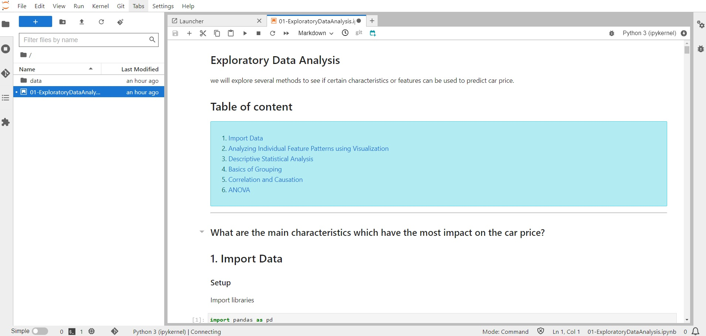

# 01-EDA (Exploratory Data Analysis)

[01-ExploratoryDataAnalysis](./work/01-ExploratoryDataAnalysis.ipynb)



---

## Start the notebook
```bash
dos2unix ./run.sh;
chmod +x ./run.sh;
./run.sh;
```
---
