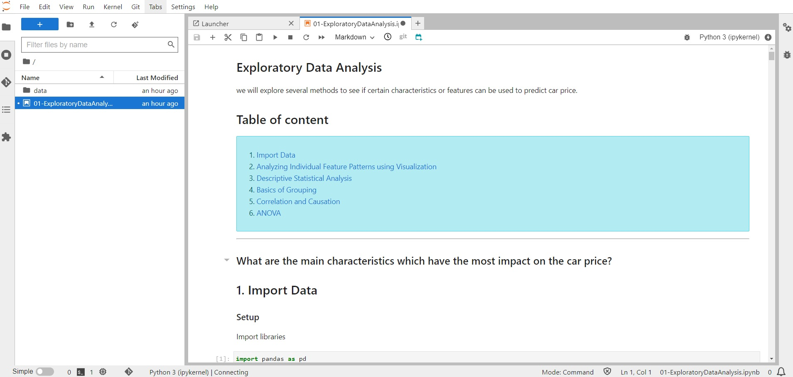

# learn-ml
A public repo to demonstrate different machine learning algorithm and their applications via Jupyter notebook

# Pre-requisites
### Docker
This requires Docker to be installed on your machine 

[📖 Installation Guide](https://docs.docker.com/get-docker/#supported-platforms).

---

# Jupyter Notebooks

## Exploratory Data Analysis

[01-ExploratoryDataAnalysis](jupyter/work/01-ExploratoryDataAnalysis.ipynb)



---

# Folders
```

├───assets
├───cheatsheets
├───docs
├───jupyter
│   └───work
│       ├───Part 0 - Exploratory Data Analysis
│       │   └───Python
│       │       └───data
│       ├───Part 1 - Data Preprocessing
│       │   └───Section 2 -------------------- Part 1 - Data Preprocessing --------------------
│       │       ├───Python
│       │       └───R
│       ├───Part 10 - Model Selection _ Boosting
│       │   ├───Section 48 - Model Selection
│       │   │   ├───Python
│       │   │   └───R
│       │   └───Section 49 - XGBoost
│       │       ├───Python
│       │       └───R
│       ├───Part 2 - Regression
│       │   ├───Section 4 - Simple Linear Regression
│       │   │   ├───Python
│       │   │   └───R
│       │   ├───Section 5 - Multiple Linear Regression
│       │   │   ├───Python
│       │   │   └───R
│       │   ├───Section 6 - Polynomial Regression
│       │   │   ├───Python
│       │   │   └───R
│       │   ├───Section 7 - Support Vector Regression (SVR)
│       │   │   ├───Python
│       │   │   └───R
│       │   ├───Section 8 - Decision Tree Regression
│       │   │   ├───Python
│       │   │   └───R
│       │   └───Section 9 - Random Forest Regression
│       │       ├───Python
│       │       └───R
│       ├───Part 3 - Classification
│       │   ├───Section 14 - Logistic Regression
│       │   │   ├───Python
│       │   │   └───R
│       │   ├───Section 15 - K-Nearest Neighbors (K-NN)
│       │   │   ├───Python
│       │   │   └───R
│       │   ├───Section 16 - Support Vector Machine (SVM)
│       │   │   ├───Python
│       │   │   └───R
│       │   ├───Section 17 - Kernel SVM
│       │   │   ├───Python
│       │   │   └───R
│       │   ├───Section 18 - Naive Bayes
│       │   │   ├───Python
│       │   │   └───R
│       │   ├───Section 19 - Decision Tree Classification
│       │   │   ├───Python
│       │   │   └───R
│       │   └───Section 20 - Random Forest Classification
│       │       ├───Python
│       │       └───R
│       ├───Part 4 - Clustering
│       │   ├───Section 24 - K-Means Clustering
│       │   │   ├───Python
│       │   │   └───R
│       │   └───Section 25 - Hierarchical Clustering
│       │       ├───Python
│       │       └───R
│       ├───Part 5 - Association Rule Learning
│       │   ├───Section 28 - Apriori
│       │   │   ├───Python
│       │   │   └───R
│       │   └───Section 29 - Eclat
│       │       ├───Python
│       │       └───R
│       ├───Part 6 - Reinforcement Learning
│       │   ├───Section 32 - Upper Confidence Bound (UCB)
│       │   │   ├───Python
│       │   │   └───R
│       │   └───Section 33 - Thompson Sampling
│       │       ├───Python
│       │       └───R
│       ├───Part 7 - Natural Language Processing
│       │   └───Section 36 - Natural Language Processing
│       │       ├───Python
│       │       └───R
│       ├───Part 8 - Deep Learning
│       │   ├───Section 39 - Artificial Neural Networks (ANN)
│       │   │   ├───Python
│       │   │   └───R
│       │   └───Section 40 - Convolutional Neural Networks (CNN)
│       │       └───Python
│       └───Part 9 - Dimensionality Reduction
│           ├───Section 43 - Principal Component Analysis (PCA)
│           │   ├───Python
│           │   └───R
│           ├───Section 44 - Linear Discriminant Analysis (LDA)
│           │   ├───Python
│           │   └───R
│           └───Section 45 - Kernel PCA
│               ├───Python
│               └───R
├───referrence_docs
└───research_papers

```
